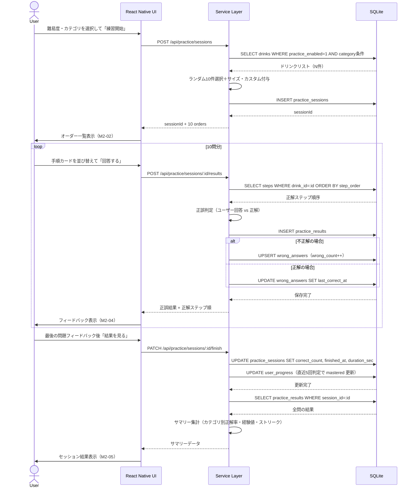
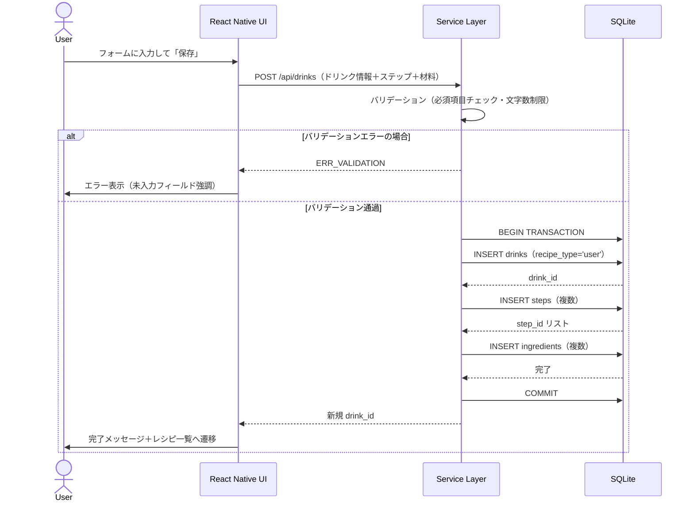
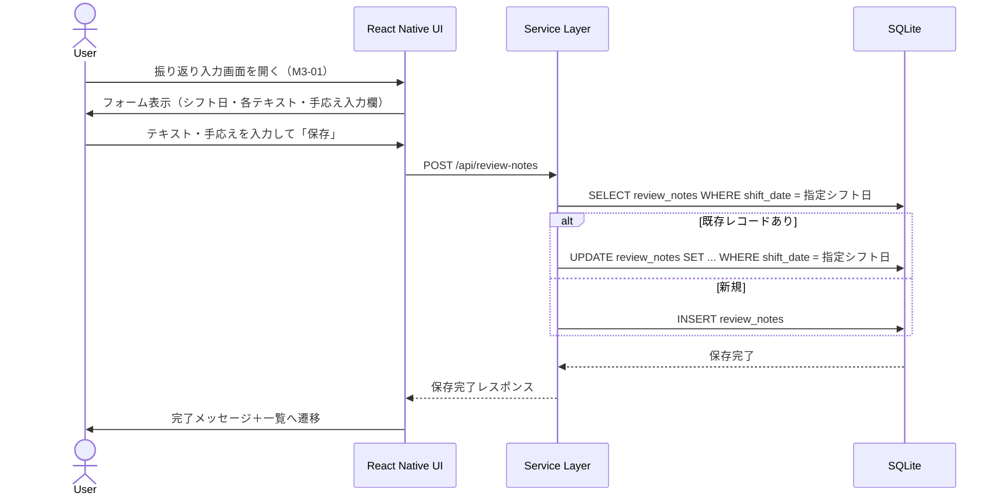
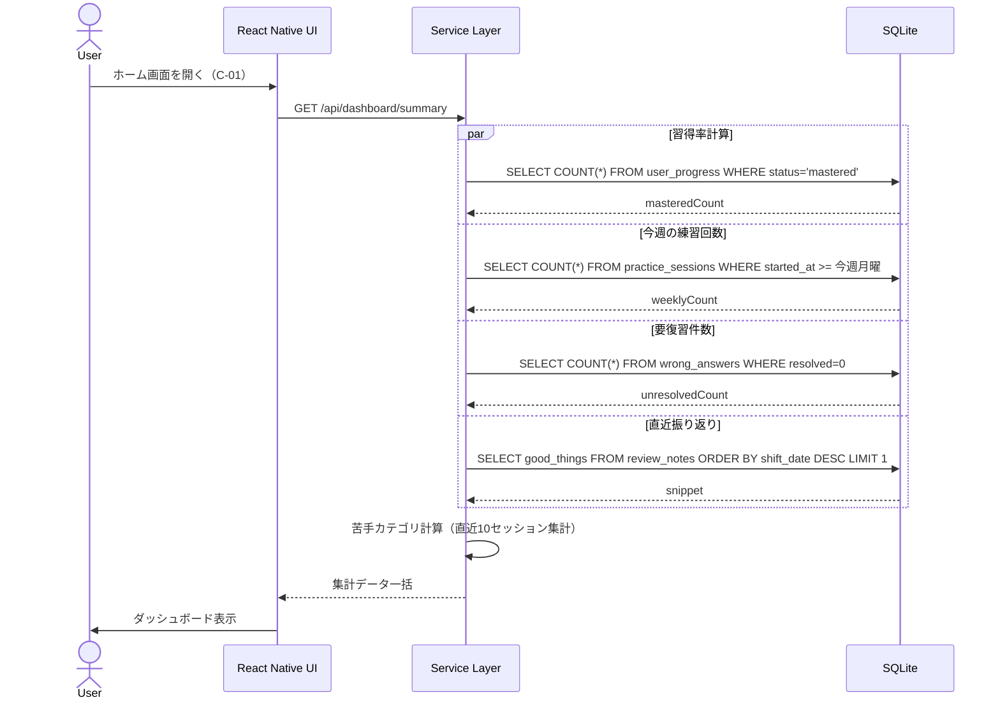

# API設計書

**プロジェクト名**: スタバ研修アプリ
**バージョン**: 1.0
**作成日**: 2026-02-22

> **設計方針**: 本アプリはオフライン完全対応のため、外部ネットワーク通信は行わない。
> API は SQLite（expo-sqlite）へのローカルクエリを Service 層の関数として実装する。
> 本書の「エンドポイント」は、TypeScript における Service 関数の呼び出しインターフェースを REST 風に表現したものである。

---

## 目次

1. [エンドポイント一覧](#1-エンドポイント一覧)
2. [認証方式](#2-認証方式)
3. [共通仕様](#3-共通仕様)
4. [エンドポイント詳細](#4-エンドポイント詳細)
   - [ダッシュボード](#41-ダッシュボード)
   - [ドリンク（レシピ管理）](#42-ドリンクレシピ管理)
   - [練習セッション](#43-練習セッション)
   - [振り返り記録](#44-振り返り記録)
   - [間違い問題](#45-間違い問題)
   - [学習進捗](#46-学習進捗)
   - [設定](#47-設定)
5. [エラーコード一覧](#5-エラーコード一覧)
6. [APIシーケンス図](#6-apiシーケンス図)

---

## 1. エンドポイント一覧

| # | メソッド | パス | 概要 | 関連画面 |
|---|---------|------|------|---------|
| 1 | GET | /api/dashboard/summary | ダッシュボード集計データ取得 | C-01 |
| 2 | GET | /api/drinks | ドリンク一覧取得（フィルタリング対応） | M1-01 |
| 3 | POST | /api/drinks | ユーザーレシピ新規登録 | M1-04 |
| 4 | GET | /api/drinks/:id | ドリンク詳細取得（ステップ・材料含む） | M1-02, M1-03 |
| 5 | PUT | /api/drinks/:id | ユーザーレシピ更新 | M1-05 |
| 6 | DELETE | /api/drinks/:id | ユーザーレシピ削除 | M1-05 |
| 7 | GET | /api/drinks/:id/custom-options | カスタム選択肢一覧取得 | M1-03 |
| 8 | POST | /api/practice/sessions | 練習セッション作成・オーダー生成 | M2-01 |
| 9 | GET | /api/practice/sessions/:id | セッション情報取得 | M2-02 |
| 10 | POST | /api/practice/sessions/:id/results | 採点結果1問分を保存 | M2-04 |
| 11 | PATCH | /api/practice/sessions/:id/finish | セッション終了処理 | M2-05 |
| 12 | GET | /api/practice/sessions/:id/summary | セッション結果サマリー取得 | M2-05 |
| 13 | POST | /api/practice/sessions/review | 間違い問題セッション作成 | M3-05 |
| 14 | GET | /api/review-notes | 振り返り一覧取得 | M3-02 |
| 15 | POST | /api/review-notes | 振り返り新規作成 | M3-01 |
| 16 | GET | /api/review-notes/:id | 振り返り詳細取得 | M3-03 |
| 17 | PUT | /api/review-notes/:id | 振り返り更新 | M3-03 |
| 18 | DELETE | /api/review-notes/:id | 振り返り削除 | M3-03 |
| 19 | GET | /api/wrong-answers | 間違い問題リスト取得 | M3-04 |
| 20 | PATCH | /api/wrong-answers/:drink_id/resolve | 間違い問題を消化済みに更新 | M3-05 |
| 21 | GET | /api/progress | 習得進捗一覧取得 | C-01, M1-01 |
| 22 | PATCH | /api/progress/:drink_id | 習得ステータス更新 | M1-02 |
| 23 | GET | /api/settings | 設定取得 | C-02 |
| 24 | PATCH | /api/settings | 設定更新 | C-02 |
| 25 | POST | /api/settings/reset | 全学習データリセット | C-02 |

---

## 2. 認証方式

本アプリはシングルユーザー・オフライン完全対応のアーキテクチャであるため、認証機能は実装しない。端末内 SQLite への直接アクセスであり、ユーザー識別・セッショントークン・API キー等は不要である。

将来的にマルチデバイス同期・クラウドバックアップを導入する場合は、JWT ベースの認証機構を追加する。

---

## 3. 共通仕様

### 3.1 レスポンス形式

すべてのレスポンスは以下のラッパー形式を使用する。

```json
{
  "success": true,
  "data": { ... },
  "error": null
}
```

エラー時:

```json
{
  "success": false,
  "data": null,
  "error": {
    "code": "ERR_NOT_FOUND",
    "message": "指定されたリソースが見つかりません"
  }
}
```

### 3.2 日時形式

すべての日時は ISO 8601 形式（`YYYY-MM-DDTHH:mm:ss.sssZ`）の文字列として返す。

### 3.3 Boolean 値

SQLite の制約により、Boolean は `0`（false）/ `1`（true）の整数で DB に保存するが、API レスポンスでは JavaScript の `boolean` 型（`true` / `false`）として返す。

---

## 4. エンドポイント詳細

### 4.1 ダッシュボード

#### GET /api/dashboard/summary

ダッシュボード表示に必要な全集計データを一括返却する。

**レスポンス例:**

```json
{
  "success": true,
  "data": {
    "masteredCount": 32,
    "totalDrinkCount": 46,
    "masteredRate": 0.696,
    "weeklyPracticeCount": 5,
    "unresolvedWrongCount": 3,
    "weakestCategory": "frappuccino",
    "weakestCategoryRate": 0.45,
    "latestReviewSnippet": "アフォガートの手順を初めて覚えた。スプーンの使い方に注意...",
    "currentStreak": 7,
    "totalScore": 142
  },
  "error": null
}
```

---

### 4.2 ドリンク（レシピ管理）

#### GET /api/drinks

**クエリパラメータ:**

| パラメータ | 型 | 必須 | 説明 |
|-----------|-----|------|------|
| category | string | — | hot / ice / frappuccino / seasonal / user_limited / all |
| sub_category | string | — | サブカテゴリ名 |
| q | string | — | テキスト検索（name_ja, short_code に対して部分一致） |

**レスポンス例:**

```json
{
  "success": true,
  "data": {
    "drinks": [
      {
        "id": 1,
        "nameJa": "カフェミスト",
        "shortCode": "MIS",
        "category": "hot",
        "subCategory": "エスプレッソ系",
        "needsSleeve": false,
        "recipeType": "builtin",
        "practiceEnabled": true,
        "progress": {
          "status": "mastered"
        }
      }
    ],
    "total": 46
  },
  "error": null
}
```

---

#### POST /api/drinks

**リクエストボディ:**

```json
{
  "nameJa": "ストロベリーラベンダーフラペチーノ",
  "shortCode": "SLF",
  "category": "user_limited",
  "subCategory": "フルーツ系",
  "needsSleeve": false,
  "specialEquipment": "バイタミックス使用",
  "memo": "2026春限定。バニラクリームフラペベースで作る。",
  "practiceEnabled": true,
  "steps": [
    {
      "stepOrder": 1,
      "isRequired": true,
      "description": "バイタミックスにストロベリーピューレを入れる",
      "ingredients": [
        {
          "name": "ストロベリーピューレ",
          "qtyShort": 2,
          "qtyTall": 2,
          "qtyGrande": 3,
          "qtyVenti": 4,
          "unit": "ポンプ"
        }
      ]
    }
  ]
}
```

**レスポンス例:**

```json
{
  "success": true,
  "data": {
    "id": 47,
    "nameJa": "ストロベリーラベンダーフラペチーノ",
    "recipeType": "user",
    "createdAt": "2026-02-22T10:30:00.000Z"
  },
  "error": null
}
```

---

#### GET /api/drinks/:id

**レスポンス例:**

```json
{
  "success": true,
  "data": {
    "id": 3,
    "nameJa": "カフェアメリカーノ",
    "shortCode": "A",
    "category": "hot",
    "subCategory": "エスプレッソ系",
    "needsSleeve": false,
    "specialEquipment": null,
    "recipeType": "builtin",
    "practiceEnabled": true,
    "memo": null,
    "steps": [
      {
        "id": 15,
        "stepOrder": 1,
        "isRequired": true,
        "description": "カップにお湯を入れる",
        "ingredients": [
          {
            "id": 30,
            "name": "お湯",
            "qtyShort": null,
            "qtyTall": null,
            "qtyGrande": null,
            "qtyVenti": null,
            "unit": null
          }
        ]
      },
      {
        "id": 16,
        "stepOrder": 2,
        "isRequired": true,
        "description": "エスプレッソをダブルショット抽出してお湯の上から注ぐ",
        "ingredients": [
          {
            "id": 31,
            "name": "エスプレッソ",
            "qtyShort": 1,
            "qtyTall": 2,
            "qtyGrande": 2,
            "qtyVenti": 3,
            "unit": "ショット"
          }
        ]
      }
    ],
    "progress": {
      "status": "mastered",
      "practiceCount": 12,
      "correctRate": 0.917
    }
  },
  "error": null
}
```

---

#### PUT /api/drinks/:id

リクエストボディは POST /api/drinks と同形式。`recipe_type = 'user'` のレコードのみ更新許可。

**レスポンス例:**

```json
{
  "success": true,
  "data": {
    "id": 47,
    "updatedAt": "2026-02-22T15:00:00.000Z"
  },
  "error": null
}
```

---

#### DELETE /api/drinks/:id

`recipe_type = 'user'` のレコードのみ削除許可。CASCADE により steps・ingredients・user_progress も削除。

**レスポンス例:**

```json
{
  "success": true,
  "data": {
    "deletedId": 47
  },
  "error": null
}
```

---

#### GET /api/drinks/:id/custom-options

**レスポンス例:**

```json
{
  "success": true,
  "data": {
    "customOptions": [
      {
        "customType": "milk_change",
        "options": ["通常", "豆乳", "オーツミルク", "アーモンドミルク", "スキムミルク", "ブレベ"]
      },
      {
        "customType": "syrup_add",
        "options": ["なし", "バニラ", "キャラメル", "ヘーゼルナッツ", "クラシック", "ラベンダー"]
      },
      {
        "customType": "shot_change",
        "options": ["通常", "エクストラ", "ハーフ", "デカフェ", "リストレット"]
      }
    ]
  },
  "error": null
}
```

---

### 4.3 練習セッション

#### POST /api/practice/sessions

**リクエストボディ:**

```json
{
  "difficulty": "intermediate",
  "categoryFilter": "all"
}
```

**レスポンス例:**

```json
{
  "success": true,
  "data": {
    "sessionId": 15,
    "orders": [
      {
        "orderIndex": 1,
        "drinkId": 5,
        "drinkName": "キャラメルマキアート",
        "size": "T",
        "customs": {
          "milk_change": "豆乳"
        }
      },
      {
        "orderIndex": 2,
        "drinkId": 22,
        "drinkName": "コーヒーフラペチーノ",
        "size": "G",
        "customs": {}
      }
    ]
  },
  "error": null
}
```

---

#### POST /api/practice/sessions/:id/results

**リクエストボディ:**

```json
{
  "drinkId": 5,
  "size": "T",
  "customJson": "{\"milk_change\":\"豆乳\"}",
  "isCorrect": false,
  "userAnswerJson": "[3, 1, 2, 4]"
}
```

**レスポンス例:**

```json
{
  "success": true,
  "data": {
    "resultId": 142,
    "isCorrect": false,
    "correctStepOrder": [1, 2, 3, 4],
    "wrongAnswerUpdated": true
  },
  "error": null
}
```

---

#### PATCH /api/practice/sessions/:id/finish

**リクエストボディ:**

```json
{
  "correctCount": 7,
  "durationSec": 420
}
```

**レスポンス例:**

```json
{
  "success": true,
  "data": {
    "sessionId": 15,
    "finishedAt": "2026-02-22T11:07:00.000Z"
  },
  "error": null
}
```

---

#### GET /api/practice/sessions/:id/summary

**レスポンス例:**

```json
{
  "success": true,
  "data": {
    "sessionId": 15,
    "correctCount": 7,
    "totalCount": 10,
    "correctRate": 0.7,
    "durationSec": 420,
    "wrongDrinks": [
      { "drinkId": 5, "drinkName": "キャラメルマキアート", "wrongCount": 3 },
      { "drinkId": 22, "drinkName": "コーヒーフラペチーノ", "wrongCount": 1 }
    ],
    "categoryStats": {
      "hot": { "correct": 4, "total": 5, "rate": 0.8 },
      "ice": { "correct": 2, "total": 3, "rate": 0.667 },
      "frappuccino": { "correct": 1, "total": 2, "rate": 0.5 }
    },
    "experienceGained": 35,
    "streak": 3,
    "progressUpdates": [
      { "drinkId": 3, "newStatus": "mastered" }
    ]
  },
  "error": null
}
```

---

### 4.4 振り返り記録

#### GET /api/review-notes

**クエリパラメータ:**

| パラメータ | 型 | 説明 |
|-----------|-----|------|
| month | string | YYYY-MM 形式で月フィルタリング |
| q | string | テキスト検索（good_things, mistakes に対して部分一致） |

**レスポンス例:**

```json
{
  "success": true,
  "data": {
    "notes": [
      {
        "id": 10,
        "shiftDate": "2026-02-22",
        "goodThings": "アフォガートの手順をきれいにできた",
        "mood": "good",
        "createdAt": "2026-02-22T22:00:00.000Z"
      }
    ],
    "total": 15
  },
  "error": null
}
```

---

#### POST /api/review-notes

**リクエストボディ:**

```json
{
  "shiftDate": "2026-02-22",
  "goodThings": "アフォガートの手順をきれいにできた。先輩にも褒めてもらえた。",
  "mistakes": "フラペチーノのシロップ分量を間違えた。",
  "feedback": "バイタミックスの使い方を改めて教えてもらった。",
  "nextReview": "フラペチーノ系の分量を復習する。",
  "mood": "good"
}
```

**レスポンス例:**

```json
{
  "success": true,
  "data": {
    "id": 10,
    "shiftDate": "2026-02-22",
    "createdAt": "2026-02-22T22:05:00.000Z"
  },
  "error": null
}
```

---

### 4.5 間違い問題

#### GET /api/wrong-answers

**クエリパラメータ:**

| パラメータ | 型 | 説明 |
|-----------|-----|------|
| sort | string | `wrong_count_desc`（デフォルト）/ `last_wrong_at_desc` |

**レスポンス例:**

```json
{
  "success": true,
  "data": {
    "wrongAnswers": [
      {
        "id": 5,
        "drinkId": 22,
        "drinkName": "コーヒーフラペチーノ",
        "wrongCount": 7,
        "lastWrongAt": "2026-02-21T18:30:00.000Z",
        "lastCorrectAt": "2026-02-18T10:00:00.000Z",
        "resolved": false
      }
    ],
    "total": 3
  },
  "error": null
}
```

---

#### PATCH /api/wrong-answers/:drink_id/resolve

**リクエストボディ:** なし（パスパラメータのみ）

**レスポンス例:**

```json
{
  "success": true,
  "data": {
    "drinkId": 22,
    "resolved": true,
    "lastCorrectAt": "2026-02-22T11:30:00.000Z"
  },
  "error": null
}
```

---

### 4.6 学習進捗

#### GET /api/progress

**レスポンス例:**

```json
{
  "success": true,
  "data": {
    "progress": [
      {
        "drinkId": 1,
        "drinkName": "カフェミスト",
        "status": "mastered",
        "practiceCount": 10,
        "correctRate": 0.9,
        "lastPracticedAt": "2026-02-21T10:00:00.000Z"
      }
    ],
    "masteredCount": 32,
    "total": 46
  },
  "error": null
}
```

---

#### PATCH /api/progress/:drink_id

**リクエストボディ:**

```json
{
  "status": "learning",
  "firstViewedAt": "2026-02-22T09:15:00.000Z"
}
```

**レスポンス例:**

```json
{
  "success": true,
  "data": {
    "drinkId": 3,
    "status": "learning",
    "updatedAt": "2026-02-22T09:15:00.000Z"
  },
  "error": null
}
```

---

### 4.7 設定

#### GET /api/settings

**レスポンス例:**

```json
{
  "success": true,
  "data": {
    "defaultDifficulty": "beginner",
    "timerEnabled": false,
    "qtyQuizEnabled": false,
    "hapticsEnabled": true,
    "updatedAt": "2026-02-20T08:00:00.000Z"
  },
  "error": null
}
```

---

#### PATCH /api/settings

**リクエストボディ（部分更新可）:**

```json
{
  "defaultDifficulty": "intermediate",
  "timerEnabled": true
}
```

**レスポンス例:**

```json
{
  "success": true,
  "data": {
    "updatedAt": "2026-02-22T12:00:00.000Z"
  },
  "error": null
}
```

---

#### POST /api/settings/reset

**リクエストボディ:** なし

**レスポンス例:**

```json
{
  "success": true,
  "data": {
    "resetAt": "2026-02-22T12:05:00.000Z",
    "deletedTables": [
      "user_progress",
      "practice_sessions",
      "practice_results",
      "wrong_answers",
      "review_notes",
      "drinks(user)"
    ]
  },
  "error": null
}
```

---

## 5. エラーコード一覧

| エラーコード | HTTP相当 | 説明 | 対応画面例 |
|-------------|---------|------|-----------|
| ERR_NOT_FOUND | 404 | 指定されたリソースが存在しない | 詳細画面でID不正 |
| ERR_VALIDATION | 400 | リクエストのバリデーションエラー | レシピ登録フォームの必須項目未入力 |
| ERR_FORBIDDEN | 403 | 操作が許可されていない（builtin の削除等） | システム組込みレシピの削除試行 |
| ERR_CONFLICT | 409 | 一意制約違反（同日の振り返り二重登録等） | 同一日の振り返り重複 |
| ERR_DB | 500 | SQLite 操作エラー | DB書き込み失敗 |
| ERR_EMPTY_RESULT | 204 | 正常だがデータが0件 | 検索結果なし・間違い問題なし |
| ERR_INVALID_TYPE | 400 | recipe_type = 'builtin' への書込/削除試行 | builtin レシピへの編集・削除 |

---

## 6. APIシーケンス図

### 6.1 練習セッション全体フロー



### 6.2 ユーザーレシピ登録フロー



### 6.3 振り返り記録フロー



### 6.4 ダッシュボード表示フロー


