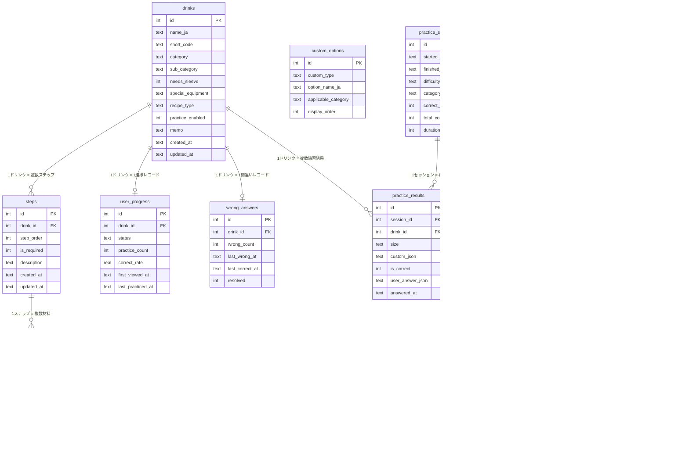

# DB設計書

**プロジェクト名**: スタバ研修アプリ
**バージョン**: 1.0
**作成日**: 2026-02-22
**DB**: SQLite（expo-sqlite）

---

## 目次

1. [テーブル一覧](#1-テーブル一覧)
2. [各テーブル定義](#2-各テーブル定義)
3. [ER図](#3-er図)
4. [インデックス設計](#4-インデックス設計)
5. [リレーション説明](#5-リレーション説明)
6. [初期データ方針](#6-初期データ方針)

---

## 1. テーブル一覧

| テーブル名 | 論理名 | 種別 | 説明 |
|-----------|--------|------|------|
| drinks | ドリンクマスター | マスター | 全ドリンクの基本情報。builtin/user 両方を管理 |
| steps | 手順マスター | マスター | ドリンクの手順ステップ一覧 |
| ingredients | 材料・分量マスター | マスター | 手順ごとの材料名とサイズ別分量 |
| custom_options | カスタム選択肢マスター | マスター | カスタムの種別と選択肢定義 |
| practice_sessions | 練習セッション | トランザクション | 1回の練習セッション単位の記録 |
| practice_results | 練習問題結果 | トランザクション | セッション内の1問ごとの正誤記録 |
| wrong_answers | 間違い問題リスト | トランザクション | 要復習フラグ付きの間違いドリンク管理 |
| user_progress | ドリンク別習得度 | トランザクション | ドリンクごとの習得ステータス・統計 |
| review_notes | 振り返り記録 | トランザクション | 日次振り返りテキスト記録 |
| app_settings | アプリ設定 | 設定 | シングルトン設定レコード |

---

## 2. 各テーブル定義

### 2.1 drinks（ドリンクマスター）

```sql
CREATE TABLE drinks (
    id                INTEGER  PRIMARY KEY AUTOINCREMENT NOT NULL,
    name_ja           TEXT     NOT NULL,
    short_code        TEXT,
    category          TEXT     NOT NULL
                               CHECK(category IN ('hot','ice','frappuccino','seasonal','user_limited')),
    sub_category      TEXT,
    needs_sleeve      INTEGER  NOT NULL DEFAULT 0 CHECK(needs_sleeve IN (0,1)),
    special_equipment TEXT,
    recipe_type       TEXT     NOT NULL
                               CHECK(recipe_type IN ('builtin','user')),
    practice_enabled  INTEGER  NOT NULL DEFAULT 1 CHECK(practice_enabled IN (0,1)),
    memo              TEXT,
    created_at        TEXT     NOT NULL,
    updated_at        TEXT     NOT NULL
);
```

| カラム名 | 型 | 制約 | 説明 |
|---------|-----|------|------|
| id | INTEGER | PK, AUTOINCREMENT | ドリンクID |
| name_ja | TEXT | NOT NULL | ドリンク名（日本語） |
| short_code | TEXT | — | 略称コード（MIS, CM等） |
| category | TEXT | NOT NULL, CHECK | hot/ice/frappuccino/seasonal/user_limited |
| sub_category | TEXT | — | サブカテゴリ（エスプレッソ系等） |
| needs_sleeve | INTEGER | NOT NULL, DEFAULT 0 | スリーブ要否（1=要） |
| special_equipment | TEXT | — | 特殊機材メモ |
| recipe_type | TEXT | NOT NULL, CHECK | builtin/user |
| practice_enabled | INTEGER | NOT NULL, DEFAULT 1 | 練習対象フラグ（1=含める） |
| memo | TEXT | — | ユーザーメモ |
| created_at | TEXT | NOT NULL | 作成日時（ISO8601） |
| updated_at | TEXT | NOT NULL | 更新日時（ISO8601） |

---

### 2.2 steps（手順マスター）

```sql
CREATE TABLE steps (
    id          INTEGER  PRIMARY KEY AUTOINCREMENT NOT NULL,
    drink_id    INTEGER  NOT NULL REFERENCES drinks(id) ON DELETE CASCADE,
    step_order  INTEGER  NOT NULL,
    is_required INTEGER  NOT NULL DEFAULT 1 CHECK(is_required IN (0,1)),
    description TEXT     NOT NULL,
    created_at  TEXT     NOT NULL,
    updated_at  TEXT     NOT NULL
);
```

| カラム名 | 型 | 制約 | 説明 |
|---------|-----|------|------|
| id | INTEGER | PK, AUTOINCREMENT | ステップID |
| drink_id | INTEGER | NOT NULL, FK | ドリンクID（外部キー） |
| step_order | INTEGER | NOT NULL | 手順順序（1始まりの連番） |
| is_required | INTEGER | NOT NULL, DEFAULT 1 | 必須フラグ（0=任意ステップ） |
| description | TEXT | NOT NULL | ステップ説明文 |
| created_at | TEXT | NOT NULL | 作成日時（ISO8601） |
| updated_at | TEXT | NOT NULL | 更新日時（ISO8601） |

---

### 2.3 ingredients（材料・分量マスター）

```sql
CREATE TABLE ingredients (
    id         INTEGER  PRIMARY KEY AUTOINCREMENT NOT NULL,
    step_id    INTEGER  NOT NULL REFERENCES steps(id) ON DELETE CASCADE,
    name       TEXT     NOT NULL,
    qty_short  INTEGER,
    qty_tall   INTEGER,
    qty_grande INTEGER,
    qty_venti  INTEGER,
    unit       TEXT,
    created_at TEXT     NOT NULL
);
```

| カラム名 | 型 | 制約 | 説明 |
|---------|-----|------|------|
| id | INTEGER | PK, AUTOINCREMENT | 材料ID |
| step_id | INTEGER | NOT NULL, FK | ステップID（外部キー） |
| name | TEXT | NOT NULL | 材料名 |
| qty_short | INTEGER | — | Sサイズ分量 |
| qty_tall | INTEGER | — | Tサイズ分量 |
| qty_grande | INTEGER | — | Gサイズ分量 |
| qty_venti | INTEGER | — | Vサイズ分量 |
| unit | TEXT | — | 分量単位（ポンプ/ショット等） |
| created_at | TEXT | NOT NULL | 作成日時（ISO8601） |

---

### 2.4 custom_options（カスタム選択肢マスター）

```sql
CREATE TABLE custom_options (
    id                   INTEGER  PRIMARY KEY AUTOINCREMENT NOT NULL,
    custom_type          TEXT     NOT NULL,
    option_name_ja       TEXT     NOT NULL,
    applicable_category  TEXT,
    display_order        INTEGER  NOT NULL DEFAULT 0
);
```

| カラム名 | 型 | 制約 | 説明 |
|---------|-----|------|------|
| id | INTEGER | PK, AUTOINCREMENT | カスタムオプションID |
| custom_type | TEXT | NOT NULL | 種別（milk_change, syrup_add等） |
| option_name_ja | TEXT | NOT NULL | 選択肢名（日本語） |
| applicable_category | TEXT | — | 適用カテゴリ（NULLは全共通） |
| display_order | INTEGER | NOT NULL | 表示順 |

---

### 2.5 practice_sessions（練習セッション）

```sql
CREATE TABLE practice_sessions (
    id              INTEGER  PRIMARY KEY AUTOINCREMENT NOT NULL,
    started_at      TEXT     NOT NULL,
    finished_at     TEXT,
    difficulty      TEXT     NOT NULL
                             CHECK(difficulty IN ('beginner','intermediate','advanced')),
    category_filter TEXT     NOT NULL
                             CHECK(category_filter IN ('hot','ice','frappuccino','all')),
    correct_count   INTEGER  NOT NULL DEFAULT 0,
    total_count     INTEGER  NOT NULL DEFAULT 10,
    duration_sec    INTEGER
);
```

| カラム名 | 型 | 制約 | 説明 |
|---------|-----|------|------|
| id | INTEGER | PK, AUTOINCREMENT | セッションID |
| started_at | TEXT | NOT NULL | 開始日時（ISO8601） |
| finished_at | TEXT | — | 終了日時（NULL=未完了） |
| difficulty | TEXT | NOT NULL, CHECK | 難易度（beginner/intermediate/advanced） |
| category_filter | TEXT | NOT NULL, CHECK | カテゴリフィルター |
| correct_count | INTEGER | NOT NULL, DEFAULT 0 | 正解数 |
| total_count | INTEGER | NOT NULL, DEFAULT 10 | 総問題数 |
| duration_sec | INTEGER | — | 所要時間（秒） |

---

### 2.6 practice_results（練習問題結果）

```sql
CREATE TABLE practice_results (
    id               INTEGER  PRIMARY KEY AUTOINCREMENT NOT NULL,
    session_id       INTEGER  NOT NULL REFERENCES practice_sessions(id) ON DELETE CASCADE,
    drink_id         INTEGER  NOT NULL REFERENCES drinks(id),
    size             TEXT     NOT NULL CHECK(size IN ('S','T','G','V')),
    custom_json      TEXT,
    is_correct       INTEGER  NOT NULL CHECK(is_correct IN (0,1)),
    user_answer_json TEXT,
    answered_at      TEXT     NOT NULL
);
```

| カラム名 | 型 | 制約 | 説明 |
|---------|-----|------|------|
| id | INTEGER | PK, AUTOINCREMENT | 結果ID |
| session_id | INTEGER | NOT NULL, FK | セッションID（外部キー） |
| drink_id | INTEGER | NOT NULL, FK | ドリンクID（外部キー） |
| size | TEXT | NOT NULL, CHECK | サイズ（S/T/G/V） |
| custom_json | TEXT | — | カスタム内容JSON文字列 |
| is_correct | INTEGER | NOT NULL, CHECK | 正誤（1=正解, 0=不正解） |
| user_answer_json | TEXT | — | ユーザー回答JSON文字列 |
| answered_at | TEXT | NOT NULL | 回答日時（ISO8601） |

---

### 2.7 wrong_answers（間違い問題リスト）

```sql
CREATE TABLE wrong_answers (
    id             INTEGER  PRIMARY KEY AUTOINCREMENT NOT NULL,
    drink_id       INTEGER  NOT NULL UNIQUE REFERENCES drinks(id),
    wrong_count    INTEGER  NOT NULL DEFAULT 1,
    last_wrong_at  TEXT     NOT NULL,
    last_correct_at TEXT,
    resolved       INTEGER  NOT NULL DEFAULT 0 CHECK(resolved IN (0,1))
);
```

| カラム名 | 型 | 制約 | 説明 |
|---------|-----|------|------|
| id | INTEGER | PK, AUTOINCREMENT | 間違いID |
| drink_id | INTEGER | NOT NULL, UNIQUE, FK | ドリンクID（1ドリンク1レコード） |
| wrong_count | INTEGER | NOT NULL, DEFAULT 1 | 間違え回数 |
| last_wrong_at | TEXT | NOT NULL | 最終間違い日時（ISO8601） |
| last_correct_at | TEXT | — | 最終正解日時（NULL=未正解） |
| resolved | INTEGER | NOT NULL, DEFAULT 0 | 消化フラグ（1=消化済み） |

---

### 2.8 user_progress（ドリンク別習得度）

```sql
CREATE TABLE user_progress (
    id               INTEGER  PRIMARY KEY AUTOINCREMENT NOT NULL,
    drink_id         INTEGER  NOT NULL UNIQUE REFERENCES drinks(id),
    status           TEXT     NOT NULL DEFAULT 'not_started'
                              CHECK(status IN ('not_started','learning','mastered')),
    practice_count   INTEGER  NOT NULL DEFAULT 0,
    correct_rate     REAL     NOT NULL DEFAULT 0.0,
    first_viewed_at  TEXT,
    last_practiced_at TEXT
);
```

| カラム名 | 型 | 制約 | 説明 |
|---------|-----|------|------|
| id | INTEGER | PK, AUTOINCREMENT | 進捗ID |
| drink_id | INTEGER | NOT NULL, UNIQUE, FK | ドリンクID（1ドリンク1レコード） |
| status | TEXT | NOT NULL, CHECK | 習得ステータス |
| practice_count | INTEGER | NOT NULL, DEFAULT 0 | 練習出題回数 |
| correct_rate | REAL | NOT NULL, DEFAULT 0.0 | 正解率（0.0〜1.0） |
| first_viewed_at | TEXT | — | 初回閲覧日時（ISO8601） |
| last_practiced_at | TEXT | — | 最終練習日時（ISO8601） |

---

### 2.9 review_notes（振り返り記録）

```sql
CREATE TABLE review_notes (
    id          INTEGER  PRIMARY KEY AUTOINCREMENT NOT NULL,
    shift_date  TEXT     NOT NULL UNIQUE,
    good_things TEXT,
    mistakes    TEXT,
    feedback    TEXT,
    next_review TEXT,
    mood        TEXT     CHECK(mood IN ('good','okay','bad')),
    created_at  TEXT     NOT NULL,
    updated_at  TEXT     NOT NULL
);
```

| カラム名 | 型 | 制約 | 説明 |
|---------|-----|------|------|
| id | INTEGER | PK, AUTOINCREMENT | 振り返りID |
| shift_date | TEXT | NOT NULL, UNIQUE | シフト日（YYYY-MM-DD） |
| good_things | TEXT | — | うまくできたこと |
| mistakes | TEXT | — | 難しかった・ミスしたこと |
| feedback | TEXT | — | 先輩・店長からのフィードバック |
| next_review | TEXT | — | 次のシフトまでに復習すること |
| mood | TEXT | CHECK | 全体的な手応え（good/okay/bad） |
| created_at | TEXT | NOT NULL | 作成日時（ISO8601） |
| updated_at | TEXT | NOT NULL | 更新日時（ISO8601） |

---

### 2.10 app_settings（アプリ設定）

```sql
CREATE TABLE app_settings (
    id                INTEGER  PRIMARY KEY DEFAULT 1,
    default_difficulty TEXT    NOT NULL DEFAULT 'beginner'
                               CHECK(default_difficulty IN ('beginner','intermediate','advanced')),
    timer_enabled     INTEGER  NOT NULL DEFAULT 0 CHECK(timer_enabled IN (0,1)),
    qty_quiz_enabled  INTEGER  NOT NULL DEFAULT 0 CHECK(qty_quiz_enabled IN (0,1)),
    haptics_enabled   INTEGER  NOT NULL DEFAULT 1 CHECK(haptics_enabled IN (0,1)),
    updated_at        TEXT     NOT NULL
);
```

---

## 3. ER図



---

## 4. インデックス設計

```sql
-- ドリンク一覧の高速フィルタリング用
CREATE INDEX idx_drinks_category ON drinks(category);
CREATE INDEX idx_drinks_recipe_type ON drinks(recipe_type);
CREATE INDEX idx_drinks_practice_enabled ON drinks(practice_enabled);

-- 手順取得の高速化用
CREATE INDEX idx_steps_drink_id ON steps(drink_id);
CREATE INDEX idx_steps_drink_order ON steps(drink_id, step_order);

-- 材料取得の高速化用
CREATE INDEX idx_ingredients_step_id ON ingredients(step_id);

-- 練習結果の高速集計用
CREATE INDEX idx_practice_results_session_id ON practice_results(session_id);
CREATE INDEX idx_practice_results_drink_id ON practice_results(drink_id);
CREATE INDEX idx_practice_results_answered_at ON practice_results(answered_at);

-- 練習セッションの時系列検索用
CREATE INDEX idx_practice_sessions_started_at ON practice_sessions(started_at);

-- 間違い問題リストの高速取得用
CREATE INDEX idx_wrong_answers_resolved ON wrong_answers(resolved);
CREATE INDEX idx_wrong_answers_wrong_count ON wrong_answers(wrong_count DESC);

-- 振り返り記録の月別フィルター用
CREATE INDEX idx_review_notes_record_date ON review_notes(record_date);

-- 習得進捗の一覧取得用
CREATE INDEX idx_user_progress_status ON user_progress(status);
CREATE INDEX idx_user_progress_drink_id ON user_progress(drink_id);
```

---

## 5. リレーション説明

| リレーション | 種別 | 説明 |
|-------------|------|------|
| drinks → steps | 1対多 | 1つのドリンクは複数の手順ステップを持つ。ドリンク削除時にステップもカスケード削除。 |
| steps → ingredients | 1対多 | 1つのステップは複数の材料・分量を持つ。ステップ削除時に材料もカスケード削除。 |
| drinks → user_progress | 1対0..1 | ドリンク1件に対して習得進捗レコードは最大1件。初回閲覧/練習時に自動生成。 |
| drinks → wrong_answers | 1対0..1 | ドリンク1件に対して間違いレコードは最大1件（UNIQUE制約）。間違い時にUPSERT。 |
| drinks → practice_results | 1対多 | 1つのドリンクは複数の練習問題結果を持つ。セッション横断で集計に使用。 |
| practice_sessions → practice_results | 1対多 | 1つのセッションは最大10件の問題結果を持つ。セッション削除時にカスケード削除。 |
| custom_options | 独立 | カスタム選択肢は他テーブルへの外部キーを持たない。アプリ内でコード参照のみ。 |
| app_settings | 独立 | id=1 の1レコードのみを持つシングルトンテーブル。他テーブルとのリレーションなし。 |
| review_notes | 独立 | シフト振り返り記録は他テーブルへの外部キーを持たない。シフト日（shift_date）のみを識別キーとする独立テーブル。 |

---

## 6. 初期データ方針

| 種別 | 方針 |
|------|------|
| システム組込みレシピ（builtin） | アプリのJSONファイルまたはSQLシードスクリプトとして同梱し、初回起動時にSQLiteへINSERT |
| カスタム選択肢（custom_options） | custom_optionsテーブルにシードデータとして投入（ミルク変更・シロップ追加等の全選択肢） |
| APP_SETTINGS | 初回起動時にDEFAULT値でid=1のレコードをINSERT |
| ユーザーデータ | 初期データなし。ユーザー操作でのみ生成 |
| 既存データの保護 | マイグレーション時にrecipe_type = 'builtin'のレコードは削除・変更しない |
