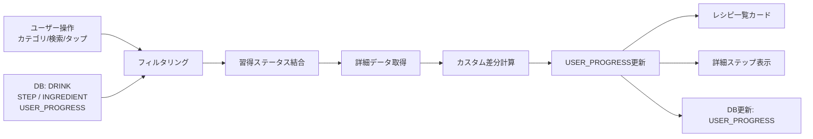
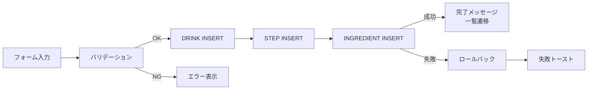
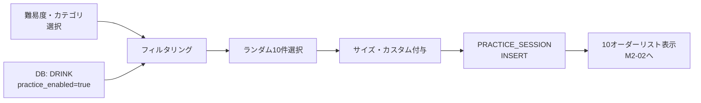
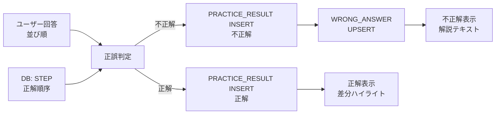
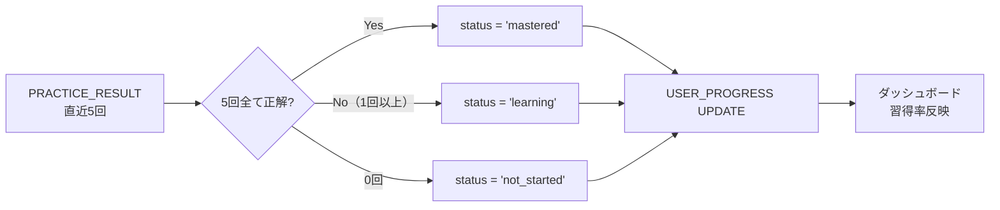

# IPO整理書（Input / Process / Output）

**プロジェクト名**: スタバ研修アプリ
**バージョン**: 1.0
**作成日**: 2026-02-22

---

## 目次

1. [レシピ閲覧フロー](#1-レシピ閲覧フロー)
2. [ユーザーレシピ登録フロー](#2-ユーザーレシピ登録フロー)
3. [ユーザーレシピ削除フロー](#3-ユーザーレシピ削除フロー)
4. [練習セッション実行フロー](#4-練習セッション実行フロー)
5. [問題採点フロー](#5-問題採点フロー)
6. [振り返り記録フロー](#6-振り返り記録フロー)
7. [間違い問題 再練習フロー](#7-間違い問題-再練習フロー)
8. [習得ステータス更新フロー](#8-習得ステータス更新フロー)
9. [ダッシュボード集計フロー](#9-ダッシュボード集計フロー)
10. [データリセットフロー](#10-データリセットフロー)

---

## 1. レシピ閲覧フロー

| 要素 | 内容 |
|------|------|
| **Input** | ユーザー操作（カテゴリタブ切替・フィルター選択・テキスト入力・カードタップ） |
| **Input** | DBデータ: DRINK（全レコード）、STEP（対象ドリンクの全ステップ）、INGREDIENT（分量データ）、USER_PROGRESS（習得ステータス） |
| **Process** | 1. カテゴリ・サブカテゴリ・テキストでDRINKをフィルタリング |
| **Process** | 2. 各DRINKにUSER_PROGRESSの習得ステータスを結合 |
| **Process** | 3. カードタップ時に該当DRINKのSTEP・INGREDIENTを取得 |
| **Process** | 4. カスタムトグル切替時にカスタムに応じたステップ差分を計算 |
| **Process** | 5. 初回閲覧時にUSER_PROGRESS.status を「未学習→学習中」に更新 |
| **Output** | レシピ一覧カード（カテゴリバッジ・習得度スター付き） |
| **Output** | レシピ詳細ステップカードリスト（S/T/G/V分量テーブル付き） |
| **Output** | カスタムありバージョンのハイライト表示 |
| **Output** | USER_PROGRESS テーブル更新（status = 'learning'） |

---

## 2. ユーザーレシピ登録フロー

| 要素 | 内容 |
|------|------|
| **Input** | フォーム入力: ドリンク名・略称コード・カテゴリ・サブカテゴリ・スリーブフラグ・特記事項・メモ |
| **Input** | ステップ入力: ステップ説明・任意フラグ・材料名・S/T/G/V分量 |
| **Input** | 練習対象フラグ（ON/OFF） |
| **Process** | 1. 必須項目（ドリンク名・カテゴリ・最低1ステップ）のバリデーション |
| **Process** | 2. バリデーション通過後、DRINKテーブルにレコードをINSERT（recipe_type = 'user'） |
| **Process** | 3. STEPテーブルに各ステップをstep_order付きでINSERT |
| **Process** | 4. INGREDIENTテーブルに各材料・分量をINSERT |
| **Process** | 5. エラー発生時は全テーブルをロールバック |
| **Output** | DRINKテーブル: 新規レコード（recipe_type = 'user'） |
| **Output** | STEPテーブル: 新規レコード群 |
| **Output** | INGREDIENTテーブル: 新規レコード群 |
| **Output** | 登録完了メッセージ＋レシピ一覧への遷移 |

---

## 3. ユーザーレシピ削除フロー

| 要素 | 内容 |
|------|------|
| **Input** | 削除対象のdrink_id（recipe_type = 'user' のみ許可） |
| **Input** | 削除確認ダイアログでの「削除」タップ |
| **Process** | 1. recipe_type = 'user' であることを確認（builtin は削除ブロック） |
| **Process** | 2. 確認ダイアログ表示 |
| **Process** | 3. INGREDIENT → STEP → DRINK の順でカスケード削除 |
| **Process** | 4. 関連するUSER_PROGRESSレコードも削除 |
| **Output** | 削除完了後にレシピ一覧へ遷移 |
| **Output** | DB更新: DRINK / STEP / INGREDIENT / USER_PROGRESS の削除 |

---

## 4. 練習セッション実行フロー

| 要素 | 内容 |
|------|------|
| **Input** | 難易度選択（初級/中級/上級） |
| **Input** | カテゴリ選択（ホット/アイス/フラペ/全カテゴリ） |
| **Input** | DB: DRINK（練習対象フラグON・選択カテゴリに一致するもの） |
| **Process** | 1. カテゴリ・practice_enabled条件でDRINKをフィルタリング |
| **Process** | 2. フィルタリング結果からランダムに10件選択 |
| **Process** | 3. 難易度に応じてサイズ・カスタムをランダム付与 |
| **Process** | 4. PRACTICE_SESSIONレコードをINSERT（開始日時・難易度・カテゴリ） |
| **Process** | 5. 10オーダーをM2-02に渡して表示 |
| **Output** | PRACTICE_SESSIONテーブル: 新規レコード（開始状態） |
| **Output** | 10件のオーダーリスト（ドリンク名・サイズ・カスタム） |
| **Output** | M2-02: オーダー一覧画面 |

---

## 5. 問題採点フロー

| 要素 | 内容 |
|------|------|
| **Input** | ユーザーが並び替えたステップの順序リスト |
| **Input** | DB: STEP（当該ドリンクの正しいステップ順序） |
| **Process** | 1. ユーザーの並び替え結果と正解（step_order順）を比較 |
| **Process** | 2. 全ステップが一致すれば正解、1つでも不一致は不正解と判定 |
| **Process** | 3. PRACTICE_RESULTレコードをINSERT（セッションID・ドリンクID・正誤・回答） |
| **Process** | 4. 不正解の場合: WRONG_ANSWERのwrong_count をインクリメント（存在しない場合はINSERT） |
| **Process** | 5. 正解の場合: WRONG_ANSWERの該当レコードのlast_correct_at を更新 |
| **Output** | 正誤結果（正解/不正解） |
| **Output** | 正解との差分ハイライト表示 |
| **Output** | PRACTICE_RESULTテーブル: 新規レコード |
| **Output** | WRONG_ANSWERテーブル: 更新または新規レコード |

---

## 6. 振り返り記録フロー

| 要素 | 内容 |
|------|------|
| **Input** | シフト日（デフォルト: 今日） |
| **Input** | うまくできたこと・難しかった・ミスしたこと・先輩フィードバック・次の復習事項（各テキスト、任意） |
| **Input** | 手応え選択（😊good / 😐okay / 😔bad、任意） |
| **Process** | 1. 入力内容をREVIEW_NOTEにINSERT（shift_date, good_things, mistakes, feedback, next_review, mood） |
| **Process** | 2. 既存の同シフト日レコードがある場合はUPDATE |
| **Output** | REVIEW_NOTEテーブル: 新規/更新レコード |
| **Output** | 保存完了メッセージ |
| **Output** | 振り返り一覧（M3-02）への遷移 |

---

## 7. 間違い問題 再練習フロー

| 要素 | 内容 |
|------|------|
| **Input** | DB: WRONG_ANSWER（resolved = false のレコード） |
| **Input** | DB: DRINK / STEP / INGREDIENT（間違いドリンクの詳細） |
| **Process** | 1. resolved = false のWRONG_ANSWERからドリンクIDリストを取得 |
| **Process** | 2. 対象ドリンクのSTEPをシャッフルして問題を生成 |
| **Process** | 3. 正解時: WRONG_ANSWER.resolved = true に更新 |
| **Process** | 4. 全問正解でWRONG_ANSWERが空になったら完了 |
| **Output** | WRONG_ANSWERテーブル: resolved = true に更新 |
| **Output** | 進捗インジケーター更新 |
| **Output** | 全問正解時の完了メッセージ |

---

## 8. 習得ステータス更新フロー

| 要素 | 内容 |
|------|------|
| **Input** | DB: PRACTICE_RESULT（対象ドリンクの直近5セッションの結果） |
| **Process** | 1. 練習セッション終了時に全ドリンクのUSER_PROGRESSを再計算 |
| **Process** | 2. 対象ドリンクの直近5回のPRACTICE_RESULTを取得 |
| **Process** | 3. 5回全て正解 → status = 'mastered' に更新 |
| **Process** | 4. 1回以上の練習履歴あり → status = 'learning'（未学習からの変更） |
| **Process** | 5. 5回未満または直近5回に不正解あり → status = 'learning' を維持 |
| **Output** | USER_PROGRESSテーブル: status 更新（未学習→学習中→習得済み） |
| **Output** | ダッシュボードの習得率に反映 |

---

## 9. ダッシュボード集計フロー

| 要素 | 内容 |
|------|------|
| **Input** | DB: USER_PROGRESS（全レコード） |
| **Input** | DB: PRACTICE_SESSION（当週のレコード） |
| **Input** | DB: WRONG_ANSWER（resolved = false のレコード） |
| **Input** | DB: REVIEW_NOTE（最新1件） |
| **Process** | 1. USER_PROGRESSからstatus = 'mastered' の件数をCOUNT → 習得率計算 |
| **Process** | 2. PRACTICE_SESSIONから当週（月〜日）のセッション数をCOUNT |
| **Process** | 3. WRONG_ANSWERからresolved = false の件数をCOUNT |
| **Process** | 4. PRACTICE_RESULTから直近10セッションのカテゴリ別正解率を計算 → 苦手カテゴリ特定 |
| **Process** | 5. REVIEW_NOTEから最新レコードの「今日学んだこと」冒頭50文字を取得 |
| **Output** | 習得率（X/46品, Y%）の進捗バー |
| **Output** | 今週の練習回数カード |
| **Output** | 要復習件数バッジ |
| **Output** | 苦手カテゴリハイライト |
| **Output** | 直近振り返りスニペット |

---

## 10. データリセットフロー

| 要素 | 内容 |
|------|------|
| **Input** | 設定画面でのデータリセットボタン押下 |
| **Input** | 確認ダイアログでの「リセット」タップ |
| **Process** | 1. 確認ダイアログ表示 |
| **Process** | 2. 確認後、以下テーブルの全レコードをDELETE |
| **Process** | - USER_PROGRESS（全レコード） |
| **Process** | - PRACTICE_SESSION（全レコード） |
| **Process** | - PRACTICE_RESULT（全レコード） |
| **Process** | - REVIEW_NOTE（全レコード） |
| **Process** | - WRONG_ANSWER（全レコード） |
| **Process** | 3. DRINKテーブル（builtin）とSTEP・INGREDIENTは削除しない |
| **Process** | 4. DRINKテーブル（user）は削除する |
| **Output** | 全学習データの消去 |
| **Output** | ダッシュボードが初期状態（0%）に戻る |
| **Output** | 完了メッセージの表示 |
