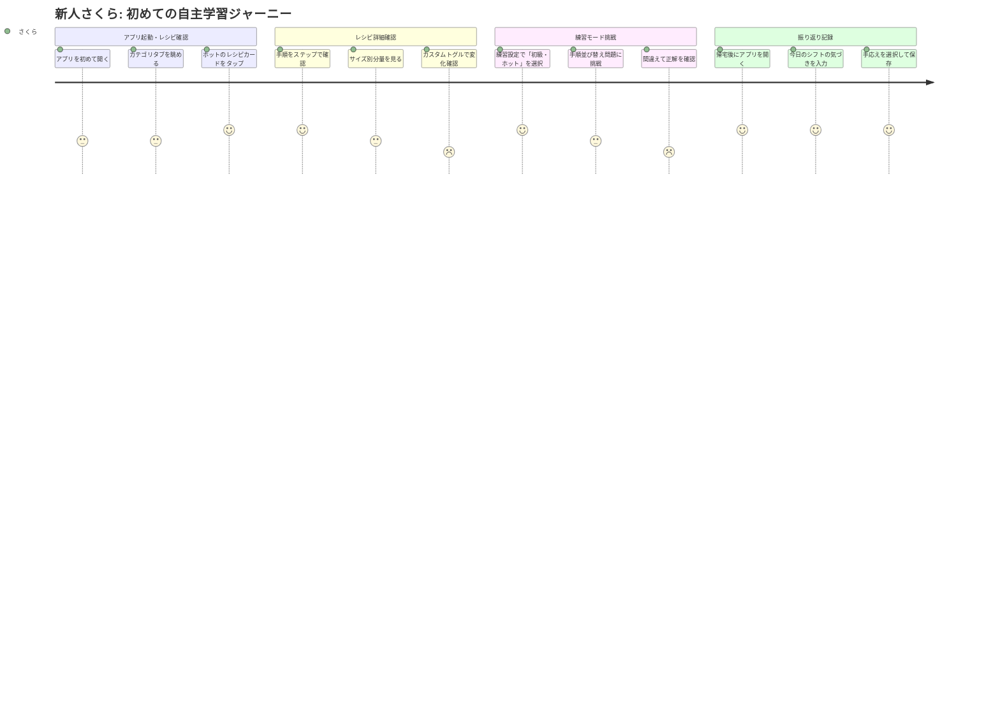
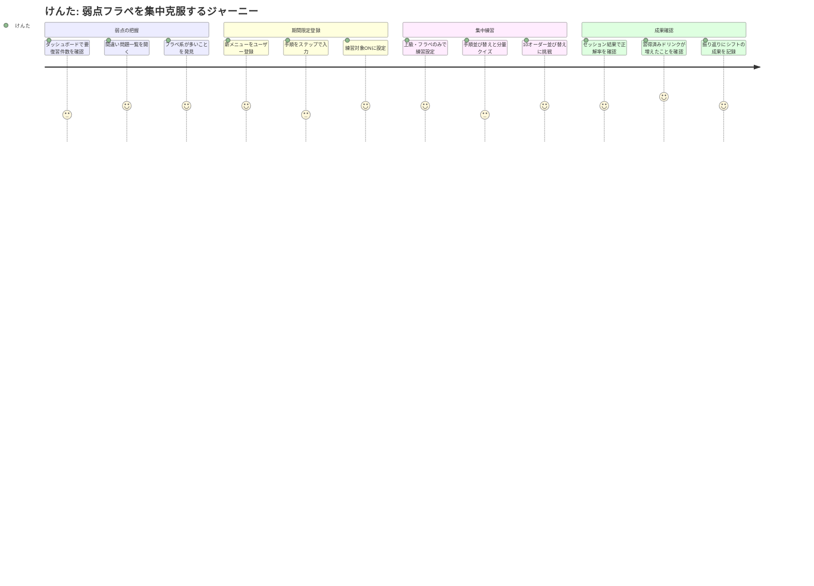
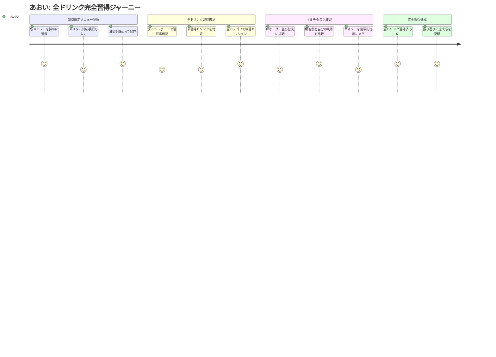

# ユーザージャーニーマップ

**プロジェクト名**: スタバ研修アプリ
**バージョン**: 1.0
**作成日**: 2026-02-22

---

## 目次

1. [ペルソナ1（さくら）: 新人が初めてレシピを自主学習するジャーニー](#journey-1)
2. [ペルソナ2（けんた）: 弱点克服のための集中練習ジャーニー](#journey-2)
3. [ペルソナ3（あおい）: 期間限定レシピ登録 → 完全習得確認ジャーニー](#journey-3)

---

## Journey 1: 新人さくらが初めてレシピを自主学習するジャーニー {#journey-1}

**ペルソナ**: 田中 さくら（入社1ヶ月）
**目標**: レシピをひとつでも覚えてシフトに臨む自信をつける

### フェーズ詳細

| フェーズ | ユーザーの行動 | 思考・感情 | タッチポイント | 課題・ペイン | アプリでできること |
|---------|--------------|-----------|--------------|------------|-----------------|
| **1. アプリ起動** | アプリを初めて開き、ホーム画面を確認する | 「どこから始めればいいんだろう」「ダッシュボードに何もない…」（不安・戸惑い） | ホーム/ダッシュボード（C-01） | 何から始めるかの導線がわからない | 学習進捗バーと「今日はここから始めよう」の提案を表示 |
| **2. レシピ一覧を眺める** | カテゴリタブを切り替えながらドリンク一覧をスクロールする | 「ドリンクこんなにあるの？」「カプチーノって何？」（驚き・好奇心） | レシピ一覧（M1-01） | 量の多さに圧倒される | カテゴリバッジと視覚的なカード形式で整理された一覧を提供 |
| **3. レシピ詳細確認** | カードをタップして手順・分量を確認する | 「S T G V ってこれがサイズのことか」「手順が多い！」（理解・驚き） | レシピ詳細（M1-02） | パラメータの意味が最初はわかりにくい | S/T/G/V のラベルと説明をわかりやすく表示 |
| **4. カスタム確認** | カスタムありトグルに切り替えてみる | 「カスタムで手順が変わるのか…複雑だな」（困惑） | レシピ詳細（M1-03） | カスタムの種類が多く混乱しやすい | 変更箇所をハイライト表示して差分を可視化 |
| **5. 練習モード挑戦** | 「初級・ホットのみ」で練習セッションを開始する | 「やってみよう！間違えても大丈夫」（期待・緊張） | 練習設定（M2-01）・手順並び替え（M2-03） | 初回は全問不正解になりやすく挫折感がある | 不正解時に丁寧な正解解説を表示。間違い問題は自動登録 |
| **6. 振り返り記録** | 帰宅後にバイトの振り返りを入力する | 「今日うまくできたこと、失敗したことを記録しておこう」（反省・前向き） | 振り返り入力（M3-01） | 記録する習慣がまだない | シフト日・手応え・フィードバックを簡単に記録できるフォームを提供 |

---

## Journey 2: けんたが弱点を集中的に克服するジャーニー {#journey-2}

**ペルソナ**: 鈴木 けんた（入社3ヶ月）
**目標**: フラペチーノ系の正解率を80%以上に引き上げる

### フェーズ詳細

| フェーズ | ユーザーの行動 | 思考・感情 | タッチポイント | 課題・ペイン | アプリでできること |
|---------|--------------|-----------|--------------|------------|-----------------|
| **1. 弱点の把握** | ダッシュボードを開き「要復習件数」と「苦手カテゴリ」を確認する | 「やっぱりフラペ系が多い。集中しなきゃ」（課題認識） | ホーム（C-01）・間違い問題一覧（M3-04） | 自分の弱点がどこかを可視化する仕組みがなかった | 苦手カテゴリのハイライトと間違い回数ランキングを提供 |
| **2. 期間限定メニュー登録** | 新しく入った期間限定メニューをユーザーレシピとして登録する | 「メモより入力がちょっとめんどくさいな。でも後で練習できるから」（面倒さと期待） | ユーザーレシピ登録（M1-04） | ステップ入力が手間に感じる場合がある | ステップをひとつずつ追加する簡易フォームで入力負荷を軽減 |
| **3. 集中練習（フラペのみ）** | 「上級・フラペチーノのみ」に設定して練習セッションを開始する | 「フラペ全部出してくれ。全部正解するまでやる」（強い意欲） | 練習設定（M2-01）・手順並び替え（M2-03）・分量クイズ（M2-03） | 難易度が高く心が折れやすい | カテゴリ絞り込みと難易度調整で集中練習を実現 |
| **4. 10オーダー並び替え** | 10オーダーの作業順を考えて並び替え、効率的な順番例と比較する | 「フラペは先にやるべきか後回しか…解説で確認しよう」（考察・理解） | オーダー一覧（M2-02） | 判断基準（セオリー）を知らないと並び替えが難しい | 効率的な順番例と理由の解説文を提示 |
| **5. 成果確認** | セッション結果とダッシュボードの習得率変化を確認する | 「習得済みが増えた！今週の目標達成できそう」（達成感・モチベーション向上） | セッション結果（M2-05）・ホーム（C-01） | 成長の実感が薄いと継続モチベーションが落ちる | 今回の正解率と累計スコアを視覚的に表示 |
| **6. 振り返り記録** | バイト後に今日の振り返りを入力する | 「フラペの分量、だいぶ固まってきた。先輩にも褒めてもらえた」（前向き達成感） | 振り返り入力（M3-01） | 継続的な記録の習慣化が課題 | うまくできたことやフィードバックをシフト後すぐに記録できる |

---

## Journey 3: あおいが期間限定レシピを登録し完全習得を確認するジャーニー {#journey-3}

**ペルソナ**: 山田 あおい（入社5ヶ月・シフトリーダー候補）
**目標**: 全ドリンク習得率100%達成 + 期間限定メニューの正確な登録

### フェーズ詳細

| フェーズ | ユーザーの行動 | 思考・感情 | タッチポイント | 課題・ペイン | アプリでできること |
|---------|--------------|-----------|--------------|------------|-----------------|
| **1. 期間限定メニュー登録** | 店舗で確認した期間限定メニューをアプリに詳細入力する（手順・材料・分量すべて） | 「正確に入力しておけば後輩への説明にも使える」（計画的・高いモチベーション） | ユーザーレシピ登録（M1-04） | 手順が多いと入力に時間がかかる | ドラッグ&ドロップでステップを並び替えられるなど入力 UX を最適化 |
| **2. 全ドリンク習得確認** | ダッシュボードを開き「全ドリンク習得率」進捗バーを確認し、未習得ドリンクを洗い出す | 「残り8品か。週末中に全部潰したい」（明確な目標設定） | ホーム（C-01）・間違い問題一覧（M3-04） | 未習得ドリンクがどれかを一目で確認する手段がなかった | 習得率の進捗バーと未習得ドリンクのリストを提供 |
| **3. 全カテゴリ練習** | 「上級・全カテゴリ」で練習セッションを実施し、未習得ドリンクを集中的に練習する | 「全問正解が出たドリンクは自動で習得済みになるのが気持ちいい」（達成感） | 練習設定（M2-01）・手順並び替え（M2-03） | 上級は難しく、正確な手順の記憶が求められる | 5回連続正解で「習得済み」ステータスになる仕組みを提供 |
| **4. マルチタスク練習** | 10オーダー並び替えで自分の判断と効率的な解答例を比較する | 「自分の判断はセオリー通りだったか確認しよう。後輩に教えるためにも理解を深めたい」（向上心） | オーダー一覧（M2-02） | 解答根拠が言語化されていないと後輩指導に活かせない | 効率的な順番のセオリー（解説文）を表示し、学習・指導に活用可能にする |
| **5. 振り返りと完全習得確認** | 全ドリンク「習得済み」達成後、ダッシュボードで100%を確認して振り返りに記録する | 「全部習得済みにできた！シフトリーダーとして自信が持てる」（達成感・自信） | ホーム（C-01）・振り返り入力（M3-01） | 達成を実感する仕組みがないとモチベーション維持が難しい | 習得率100%達成時に祝福メッセージ・バッジを表示 |
