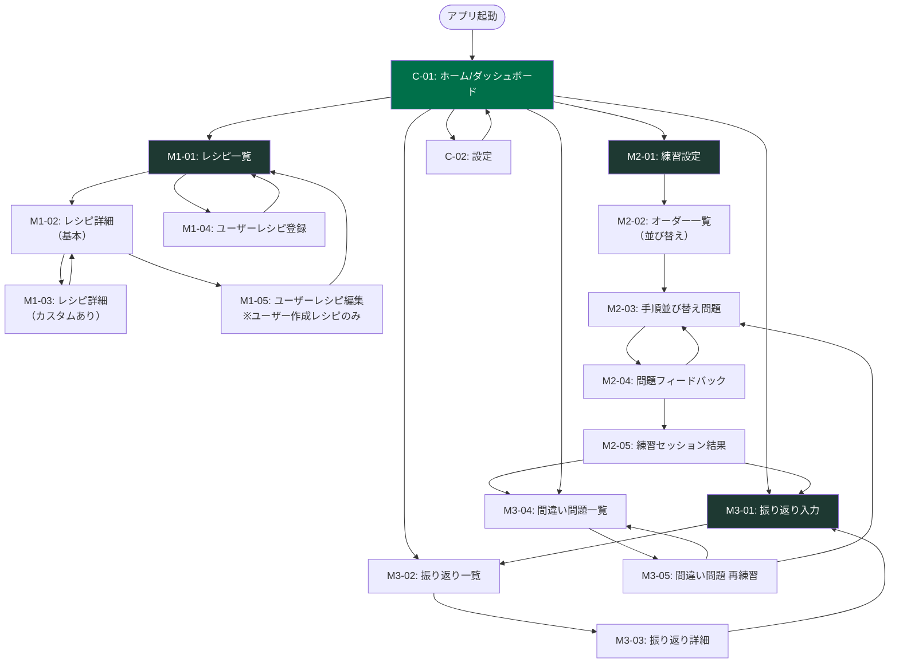

# 画面仕様概要書

**プロジェクト名**: スタバ研修アプリ
**バージョン**: 1.0
**作成日**: 2026-02-22

---

## 目次

1. [画面一覧](#1-画面一覧)
2. [各画面の主要UIコンポーネント](#2-各画面の主要uiコンポーネント)
3. [画面遷移フロー](#3-画面遷移フロー)

---

## 1. 画面一覧

### 1.1 共通画面

| 画面ID | 画面名 | 概要 |
|--------|--------|------|
| C-01 | ホーム/ダッシュボード | 学習進捗の概要表示、各機能への導線 |
| C-02 | 設定 | 難易度設定、通知設定、データリセット |

### 1.2 M1: レシピ管理画面

| 画面ID | 画面名 | 概要 |
|--------|--------|------|
| M1-01 | レシピ一覧 | カード形式でドリンクを一覧表示。カテゴリタブ・フィルター・検索機能付き |
| M1-02 | レシピ詳細（基本） | 選択したドリンクの手順をステップ番号付きカードで縦表示 |
| M1-03 | レシピ詳細（カスタムあり） | カスタム選択に応じた手順の変化を差分ハイライトで表示 |
| M1-04 | ユーザーレシピ登録 | 期間限定レシピを新規登録するフォーム画面 |
| M1-05 | ユーザーレシピ編集 | 登録済みユーザーレシピの編集フォーム |

### 1.3 M2: 実践練習画面

| 画面ID | 画面名 | 概要 |
|--------|--------|------|
| M2-01 | 練習設定 | 難易度・カテゴリを選択して練習セッションを開始する設定画面 |
| M2-02 | オーダー一覧（並び替え） | 10オーダーを表示し作業順をドラッグ&ドロップで設定 |
| M2-03 | 手順並び替え問題 | 1問ごとのシャッフルされた手順カードを並び替える問題画面 |
| M2-04 | 問題フィードバック | 1問の正誤と正解手順・解説を表示 |
| M2-05 | 練習セッション結果 | 10問終了後の正解率・苦手ドリンク・経験値サマリー |

### 1.4 M3: 振り返り・学習記録画面

| 画面ID | 画面名 | 概要 |
|--------|--------|------|
| M3-01 | 振り返り入力 | バイトシフトの振り返り（うまくできたこと・ミス・フィードバック・次の復習事項・手応え）を入力して保存 |
| M3-02 | 振り返り一覧 | 過去の振り返り記録を日付順カードで一覧表示 |
| M3-03 | 振り返り詳細 | 特定日の振り返り内容を表示・編集・削除 |
| M3-04 | 間違い問題一覧 | 要復習ドリンクの一覧（間違い回数順ソート） |
| M3-05 | 間違い問題 再練習 | 間違い問題のみを対象とした練習セッション |

---

## 2. 各画面の主要UIコンポーネント

### C-01: ホーム/ダッシュボード

| コンポーネント | 説明 |
|--------------|------|
| 習得率進捗バー | 全46品のうち「習得済み」の割合を進捗バーで表示（例: 38/46品 82%） |
| 今週の練習回数カード | 週間練習セッション数をアイコン付きで表示 |
| 要復習件数バッジ | 未消化の間違い問題数を赤バッジで強調表示 |
| 苦手カテゴリハイライト | 正解率が低いカテゴリをカラーカードで表示 |
| 直近の振り返りスニペット | 最新振り返り記録の冒頭を抜粋表示（タップで詳細へ） |
| ボトムナビゲーション | ホーム / レシピ / 練習 / 記録 / 設定の5タブ |

### C-02: 設定

| コンポーネント | 説明 |
|--------------|------|
| 難易度セレクター | 初級 / 中級 / 上級 のラジオボタン形式 |
| 制限時間トグル | 練習問題に制限時間を設けるかどうかの ON/OFF |
| 分量クイズ有効化トグル | 分量クイズ問題を練習に含めるかの ON/OFF |
| データリセットボタン | 全学習データを消去（確認ダイアログ付き） |

### M1-01: レシピ一覧

| コンポーネント | 説明 |
|--------------|------|
| カテゴリタブバー | ホット / アイス / フラペチーノ / 期間限定 / すべて の切替タブ |
| サブカテゴリフィルターチップ | タブ下部に横スクロールのフィルタリングチップ |
| 検索バー | ドリンク名・略称コードのテキスト検索 |
| ドリンクカード | ドリンク名・略称コード・カテゴリバッジ・スリーブアイコン・習得度スター |
| 新規登録 FAB | 右下の＋ボタンでユーザーレシピ登録へ遷移 |

### M1-02: レシピ詳細（基本）

| コンポーネント | 説明 |
|--------------|------|
| ドリンクヘッダー | ドリンク名・略称コード・カテゴリバッジ・スリーブアイコン |
| カスタムトグル | 「基本レシピ」↔「カスタムあり」の切替スイッチ |
| ステップカードリスト | 手順番号付きカードの縦並びリスト。任意ステップは薄いデザイン |
| 材料テーブル | S/T/G/V の4列で分量を一覧表示 |
| 注意アイコン | スリーブ・スチーム秒数など特記事項を強調 |
| 編集・削除ボタン | ユーザー作成レシピのみ表示 |

### M1-03: レシピ詳細（カスタムあり）

| コンポーネント | 説明 |
|--------------|------|
| カスタム選択パネル | ミルク変更・シロップ追加等のセレクター群 |
| 変更ハイライト | カスタムで変化する手順ステップを黄色/赤でハイライト |
| 追加ステップカード | カスタムにより追加される手順を別色カードで表示 |

### M1-04: ユーザーレシピ登録

| コンポーネント | 説明 |
|--------------|------|
| 基本情報フォーム | ドリンク名・略称コード・カテゴリ・サブカテゴリ・スリーブトグル |
| 特記事項テキスト入力 | 特殊機材・注意事項の自由入力欄 |
| メモテキスト入力 | 自由メモ欄 |
| ステップカードリスト | 追加済みステップを縦並び表示（ドラッグで並び替え） |
| ステップ追加ボタン | 「＋ステップを追加」でカードを末尾に追加 |
| 練習対象トグル | 練習セッションに含めるかの ON/OFF |
| 保存ボタン | バリデーション後に保存 |

### M2-01: 練習設定

| コンポーネント | 説明 |
|--------------|------|
| 難易度選択カード | 初級 / 中級 / 上級 の選択（説明文付き） |
| カテゴリ選択チェックボックス | ホット / アイス / フラペチーノ / 全て |
| 練習開始ボタン | タップで練習セッション（M2-02）へ遷移 |

### M2-02: オーダー一覧（並び替え）

| コンポーネント | 説明 |
|--------------|------|
| オーダーカードリスト | 10枚のオーダーカードをドラッグ&ドロップで並び替え |
| 解答例表示ボタン | 効率的な順番例と解説テキストを表示/非表示 |
| 確定ボタン | 並び替え後に最初の問題（M2-03）へ遷移 |

### M2-03: 手順並び替え問題

| コンポーネント | 説明 |
|--------------|------|
| 問題ヘッダー | ドリンク名・サイズ・カスタム内容・問題番号（例: 1/10） |
| シャッフルステップカードリスト | 並び替え対象のステップカード群（ドラッグ&ドロップ） |
| 残り時間表示 | 制限時間ONの場合にタイマーを表示 |
| 回答ボタン | 並び替え完了後にタップして採点（M2-04）へ |

### M2-04: 問題フィードバック

| コンポーネント | 説明 |
|--------------|------|
| 正誤ヘッダー | ○（正解）/ ✕（不正解）を大きく表示 |
| 正解との差分表示 | 自分の回答と正解をカラーコードで比較表示 |
| 解説テキスト | 間違いポイントの解説文 |
| 次の問題ボタン | 次のオーダー問題へ遷移 |

### M2-05: 練習セッション結果

| コンポーネント | 説明 |
|--------------|------|
| 正解率ゲージ | 10問中の正解数をアニメーションで表示 |
| 苦手ドリンクリスト | 今回不正解だったドリンクの一覧 |
| カテゴリ別正解率グラフ | ホット/アイス/フラペ別の棒グラフ |
| 経験値・ストリーク表示 | 今回獲得した経験値と連続正解数 |
| 振り返りへのCTA | 「今日の振り返りを記録する」ボタン |

### M3-01: 振り返り入力

| コンポーネント | 説明 |
|--------------|------|
| シフト日ピッカー | 日付選択（デフォルト: 今日）。過去日付も選択可 |
| うまくできたことテキスト | 自由記述テキストエリア（任意・最大500文字） |
| 難しかった・ミステキスト | 自由記述テキストエリア（任意・最大500文字） |
| フィードバックテキスト | 先輩・店長からのフィードバック入力欄（任意・最大500文字） |
| 次のシフトまでに復習することテキスト | 自由記述テキストエリア（任意・最大200文字） |
| 手応えセレクター | 😊/😐/😔の3択で全体的な手応えを選択（任意） |
| 保存ボタン | 入力内容を SQLite に保存 |

### M3-02: 振り返り一覧

| コンポーネント | 説明 |
|--------------|------|
| 月別フィルタードロップダウン | 月を選択して絞り込み |
| キーワード検索バー | 振り返り内容のテキスト検索 |
| 振り返りカードリスト | 日付・スコア・内容抜粋のカード形式リスト |

### M3-03: 振り返り詳細

| コンポーネント | 説明 |
|--------------|------|
| 日付ヘッダー | シフト日 |
| 各テキスト表示 | うまくできたこと・ミス・フィードバック・次の復習事項・手応えのテキスト表示 |
| 編集・削除ボタン | 記録の修正・削除アクション |

### M3-04: 間違い問題一覧

| コンポーネント | 説明 |
|--------------|------|
| ソートセレクター | 間違い回数順 / 最終間違い日順 |
| 間違いドリンクカード | ドリンク名・間違い回数・最終間違い日・最終正解日 |
| 再練習ボタン | 間違い問題のみでセッション開始（M3-05へ） |

### M3-05: 間違い問題 再練習

| コンポーネント | 説明 |
|--------------|------|
| 進捗インジケーター | 総問題数中の残り件数を表示 |
| 手順並び替え問題 | M2-03 と同様の問題形式 |
| 正解で消化 | 正解するとリストから除外され進捗が更新される |
| 完了画面 | 全問正解で完了メッセージを表示 |

---

## 3. 画面遷移フロー

### 遷移ルール補足

| ルール | 内容 |
|--------|------|
| ボトムナビ常時表示 | 5タブ（ホーム/レシピ/練習/記録/設定）はすべての画面から常時アクセス可能 |
| 練習中のナビ | 練習セッション中（M2-02〜M2-04）はボトムナビを非表示にし、集中を妨げない |
| 戻るボタン | 詳細 → 一覧、フォーム → 元画面への標準的な戻り遷移を設ける |
| レシピ詳細からの編集 | ユーザー作成レシピ（recipe_type = user）のみ編集・削除ボタンを表示 |
| 練習結果 → 振り返り | セッション結果画面から振り返り入力へのCTA（コールトゥアクション）を設ける |

---

## 付録: レシピ手順データ

- 構造化サマリー: `docs/requirements/specifications/recipes-structured.md`
- メニュー（価格参考）: `docs/requirements/specifications/menu-coffee.md`
- カスタムオプション: `docs/requirements/specifications/custom-options.md`
- UI/シード共通JSON: `src/constants/recipes-ui.json`
- カスタムオプションJSON: `src/constants/custom-options.json`
- SQLiteシード反映: `src/db/seed.ts`（JSONを読み込み、既存重複はスキップ）
- 練習設定カテゴリ: コーヒー / エスプレッソ / フラペチーノ / ティー / その他 / すべて
- 練習問題: 難易度ごとのカスタム付与率（初級0% / 中級30% / 上級60%）
